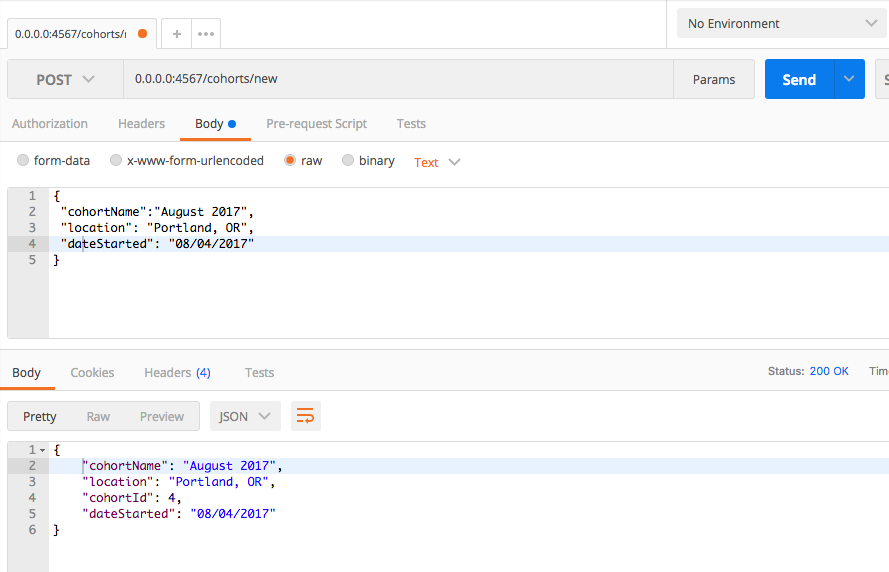
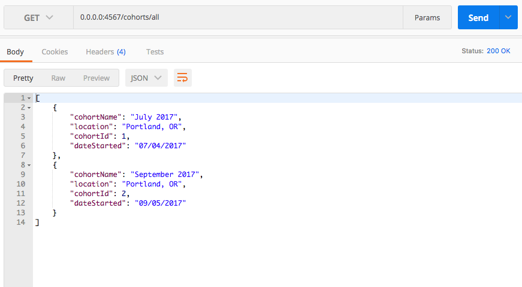
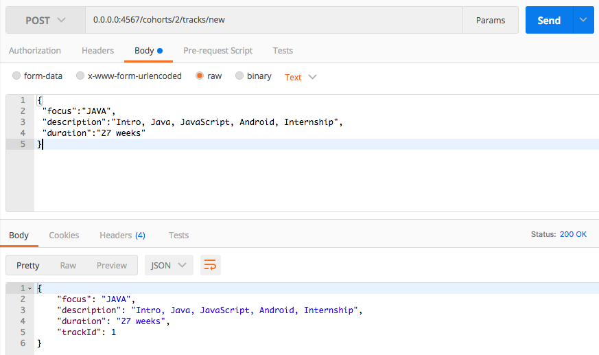
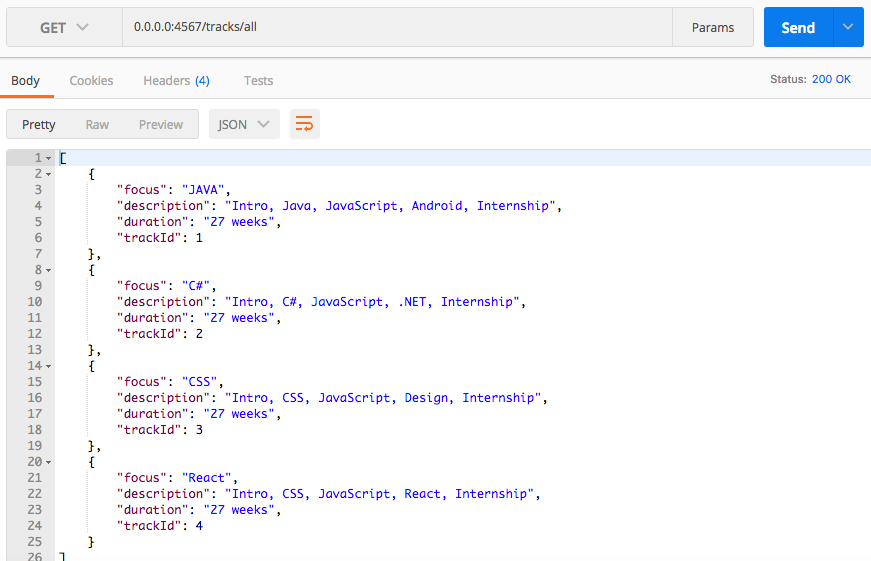
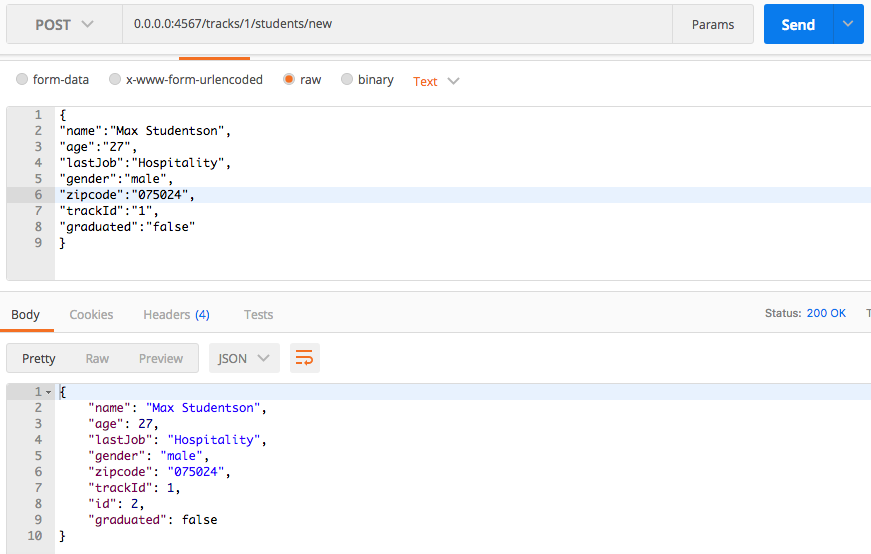
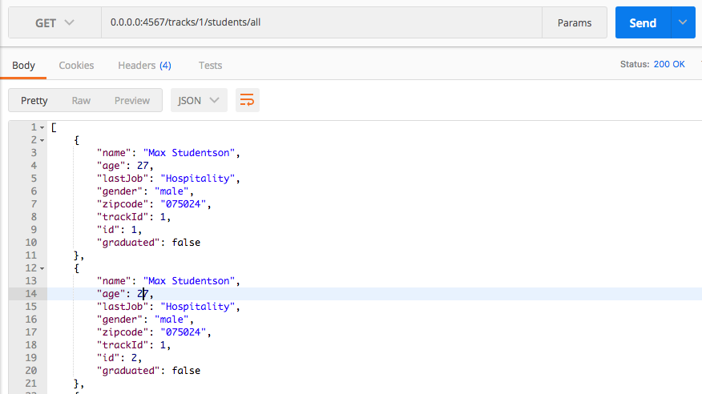

#### Epicodus API (RESTful routing), August 2017

#### By Kheifer Fuller

## Description

This java app creates an API that allows the maintenance of Epicodus student information.

## Setup/Installation Requirements

You will need Gradle and POSTMAN installed on your device.

* Clone the repo from git hub.
* Open project in IDE(I reccomend IntelliJ)
* Launch App.java
* Run POSTMAN
* Enter REST routes as defined in App.java

## Specifications

# The API should take new cohorts:

# The API should show all cohorts:

# The API should be able to add new Tracks

# The API should be able to get all Tracks

# The API should be able to add new students by Track

# The API should be able to get all students by Track

## Technologies Used

* _IntelliJ_
* _Java_
* _PostgreSQL_
* _SQL2o_
* _H2_
* _Spark_
* _Postman_

### License

MIT Copyright &copy; 2017 Kheifer Fuller
